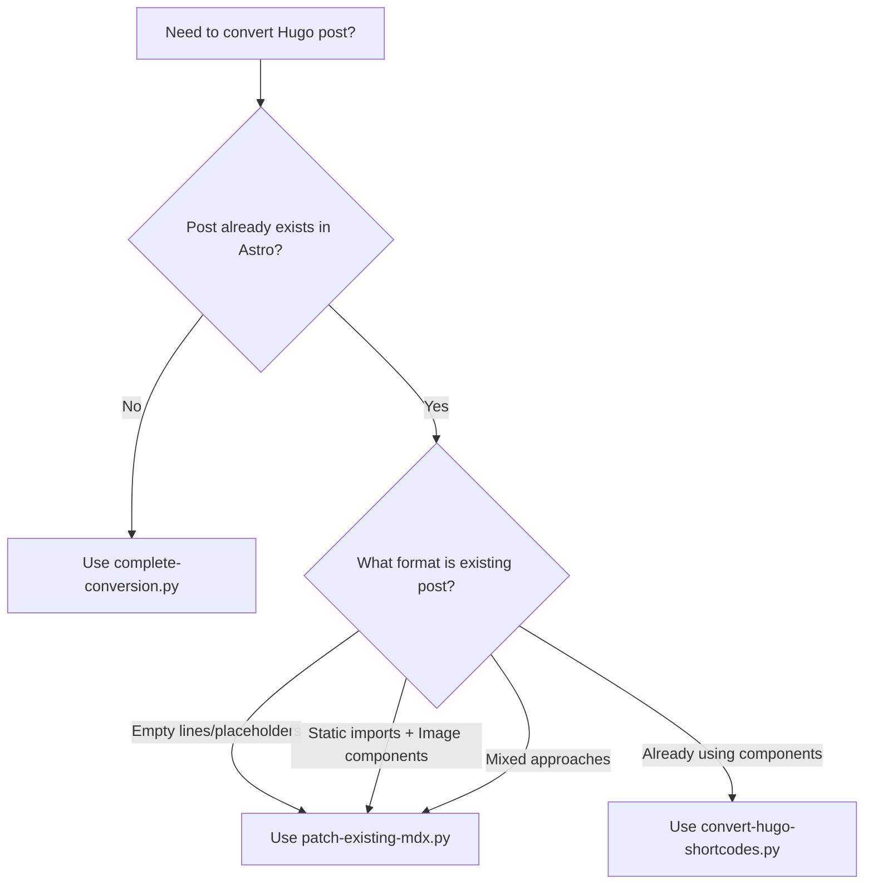

# Hugo to Astro Conversion Tools Reference

Quick reference for the three conversion tools developed for migrating Hugo posts to Astro MDX format.

## Tool Selection Guide



## 1. complete-conversion.py

**Purpose:** Full Hugo post conversion from scratch
**Best for:** New post migrations, starting fresh

### Usage

```bash
python3 complete-conversion.py <hugo-post-dir> <astro-post-name> [--dry-run]
```

### Examples

```bash
# Convert new post
python3 complete-conversion.py /Users/path/hugo/content/blog/my-post my-post

# Dry run to see what would happen
python3 complete-conversion.py /Users/path/hugo/content/blog/my-post my-post --dry-run
```

### What it does

- ✅ Converts TOML frontmatter → YAML
- ✅ Converts all Hugo shortcodes → Astro components
- ✅ Copies all image/video assets
- ✅ Adds component imports
- ✅ Creates complete, ready-to-use MDX file

### Output

```
Converting Hugo post: /path/to/hugo/post
Target Astro post: my-post
Found 15 Hugo shortcodes to convert
✅ Conversion completed:
   Created: src/data/posts/my-post.mdx
   Copied 23 asset files to: src/assets/images/blog/my-post
   Converted 15 Hugo shortcodes
```

## 2. patch-existing-mdx.py (Enhanced)

**Purpose:** Convert existing MDX files with auto-detection
**Best for:** Fixing mixed approaches, existing partial conversions

### Usage

```bash
python3 patch-existing-mdx.py <mdx-file> <hugo-source> <post-dir> [--dry-run]
```

### Examples

```bash
# Convert existing mixed approach file
python3 patch-existing-mdx.py src/data/posts/my-post.mdx /path/to/hugo/source/index.md my-post

# See what would be converted
python3 patch-existing-mdx.py src/data/posts/my-post.mdx /path/to/hugo/source/index.md my-post --dry-run
```

### Auto-Detection Logic

| File Structure                        | Strategy Used                          |
| ------------------------------------- | -------------------------------------- |
| Static imports + `<Image>` components | Component replacement + import cleanup |
| Empty line pairs (placeholders)       | Empty line replacement                 |
| Mixed/unknown                         | Fallback to empty line replacement     |

### What it does

- 🔍 **Auto-detects** existing file structure
- 🔄 **Replaces** `<Image src={var}>` with `<SingleImage>`
- 🧹 **Removes** unused static imports
- ➕ **Adds** necessary component imports
- 📊 **Reports** conversion strategy used

### Output Examples

**Static imports detected:**

```
Found 29 Hugo shortcodes in source
Detected file structure: {'has_static_imports': True, 'has_image_components': True, 'has_empty_line_pairs': False}
Using component replacement strategy...
✅ Patched src/data/posts/my-post.mdx with 15 converted components
```

**Empty lines detected:**

```
Found 52 Hugo shortcodes in source
Detected file structure: {'has_static_imports': False, 'has_image_components': False, 'has_empty_line_pairs': True}
Using empty line replacement strategy...
✅ Patched src/data/posts/my-post.mdx with 52 converted components
```

## 3. convert-hugo-shortcodes.py

**Purpose:** Simple shortcode-only conversion
**Best for:** Posts already in good MDX format, just need shortcode conversion

### Usage

```bash
python3 convert-hugo-shortcodes.py <mdx-file> --post-dir <directory-name> [--dry-run]
```

### Examples

```bash
# Convert shortcodes in existing file
python3 convert-hugo-shortcodes.py src/data/posts/my-post.mdx --post-dir my-post

# Preview conversions
python3 convert-hugo-shortcodes.py src/data/posts/my-post.mdx --post-dir my-post --dry-run
```

### What it does

- 🎯 **Focuses** only on Hugo shortcode conversion
- ➕ **Adds** component imports if missing
- 📝 **Preserves** existing file structure
- 🔍 **Reports** each conversion made

### Output

```
Processing: src/data/posts/my-post.mdx
Found 8 Hugo shortcodes to convert
✅ Converted 8 shortcodes and saved to src/data/posts/my-post.mdx
```

## Conversion Patterns

### Hugo Shortcode → Astro Component Mapping

| Hugo Input                                  | Astro Output                                                                                     | Tool Behavior              |
| ------------------------------------------- | ------------------------------------------------------------------------------------------------ | -------------------------- |
| ``  | `<SingleImage src="single.png" alt="Single" size="lg" postDir="..." />`                          | All tools                  |
| `` | `<ImageGallery images={['a.png', 'b.png']} alt="Gallery of 2 images" size="xl" postDir="..." />` | All tools                  |
| `<Image src={varName} />`                   | `<SingleImage src="image.png" alt="..." size="..." postDir="..." />`                             | patch-existing-mdx.py only |

### Alt Text Generation

- **Automatic**: Generated from filename (e.g., `my_image.png` → `"My Image"`)
- **Galleries**: Generic descriptive text (e.g., `"Gallery of 3 images"`)
- **Manual**: Can be customized after conversion

## Command Quick Reference

```bash
# Complete new conversion
python3 complete-conversion.py /path/to/hugo/post target-name

# Fix existing mixed approach
python3 patch-existing-mdx.py existing.mdx /path/to/hugo/source target-name

# Simple shortcode conversion
python3 convert-hugo-shortcodes.py existing.mdx --post-dir target-name

# Dry run any tool (add --dry-run)
python3 [tool-name] [args] --dry-run
```

## Troubleshooting

### Tool Selection Issues

**Problem**: Not sure which tool to use
**Solution**: Start with `patch-existing-mdx.py` - it auto-detects and handles most scenarios

**Problem**: Tool reports 0 conversions
**Solution**:

- Check Hugo source path is correct
- Verify Hugo shortcodes exist in source file
- Try `--dry-run` to see what would be converted

**Problem**: Images not displaying after conversion  
**Solution**:

- Verify `postDir` matches asset directory name
- Check assets were copied to `src/assets/images/blog/post-dir/`
- Ensure filenames match exactly (case sensitive)

### Conversion Quality Issues

**Problem**: Mixed approaches in same file
**Solution**: Use `patch-existing-mdx.py` with auto-detection

**Problem**: Unused imports remain
**Solution**: `patch-existing-mdx.py` automatically cleans these up

**Problem**: Wrong component type used
**Solution**:

- Single image → SingleImage component
- Multiple images → ImageGallery component
- Tools handle this automatically based on Hugo shortcode content

## Integration with Development Workflow

### Recommended Workflow

1. **Start migration**: Use `complete-conversion.py` for new posts
2. **Fix issues**: Use `patch-existing-mdx.py` for problematic conversions
3. **Test result**: Verify images display and functionality works
4. **Iterate**: Re-run tools as needed until conversion is perfect

### Development Server Integration

All tools work seamlessly with the running development server:

- Changes are reflected immediately
- Hot reload updates browser
- Asset changes trigger rebuilds
- Console shows any import warnings

### Quality Assurance

After running any conversion tool:

- [ ] Check development server console for errors
- [ ] Verify all images display correctly
- [ ] Test lightbox functionality (click images)
- [ ] Confirm responsive behavior on different screen sizes
